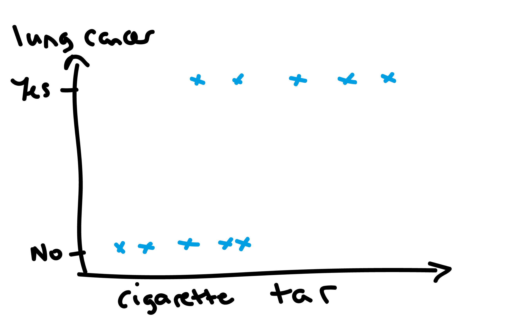

## Material covered in this lecture

- what is logistic regression and how to train this model?
- how do k-nearest neighbours methods work?
- an introduction to tree-based classifiers and regression methods

# Logistic regression

## Logistic regression

- confusingly, it is a classifier not a regression (in the ML sense)
- it is used to create models to classify binary data
- very common across ML and statistics

## Example data
```{r, echo = FALSE, out.width = "1000px",fig.align="center"}
  
```

## Cancer and coins

Denote:

- $y_i=0$ indicates cancer-free
- $y_i=1$ indicates presence of lung cancer

Two outcomes: so is like flipping a coin!

## How to model these data?
```{r, echo = FALSE, out.width = "1000px",fig.align="center"}
  
```

## Coin flipping distribution

Denote:

- $\text{Pr}(y_i=0) = 1-\theta$
- $\text{Pr}(y_i=1) = \theta$

where $0\leq \theta \leq 1$. We can represent in the following probability distribution:

$$\text{Pr}(y_i=y) = \theta^y(1-\theta)^{1-y} $$

which is known as the Bernoulli distribution:

\begin{equation}
y_i \sim \text{Bernoulli}(\theta)
\end{equation}

## How to estimate coin bias?

Suppose you flip coin twice: $y_1=1$, $y_2=0$. Assuming independence:

\begin{equation}
\text{Pr}(y_1=1,y_2=0|\theta) = \theta \times (1-\theta).
\end{equation}

We call $L(\theta)=\text{Pr}(y_1=1,y_2=0|\theta)$ a likelihood.

## Maximum likelihood estimation

Want to choose $\theta$ to maximise probability of obtaining those results

```{r, echo = FALSE, out.width = "700px",fig.align="center"}
  knitr::include_graphics("figures/logistic-3.png")
```

## Derivatives

Find maximum by differentiating:

\begin{equation}
\frac{d L}{d\theta} = 1 - 2 \theta = 0
\end{equation}

Rearranging, we obtain:

\begin{equation}
\theta = \frac{1}{2}
\end{equation}

## How to model these data?
```{r, echo = FALSE, out.width = "1000px",fig.align="center"}
  
```

## Biased coins
```{r, echo = FALSE, out.width = "1000px",fig.align="center"}
  knitr::include_graphics("figures/logistic-2.png")
```

## How to model bias?

In logistic regression, we use logistic function:

\begin{equation}
\theta = \frac{1}{1 + \exp (-x)}
\end{equation}

```{r, echo = FALSE, out.width = "600px",fig.align="center"}
  knitr::include_graphics("figures/logistic-regression.png")
```

## Logistic regression

We want to estimate how sensitive presence / absence of lung cancer is to tar, so model probability:

\begin{equation}
\theta_i = f_\beta(x_i) := \frac{1}{1 + \exp (-(\beta_0 + \beta_1 x_i))}
\end{equation}

which is known as logistic regression and assume:

\begin{equation}
y_i \sim \text{Bernoulli}(\theta_i)
\end{equation}

## How to estimate $\beta_0$ and $\beta_1$?

Data for one individual $(x_i,y_i)$ has probability:

$$\text{Pr}(y_i=y) = f_\beta(x_i)^y(1-f_\beta(x_i))^{1-y} $$

## Likelihood for two individuals' data

Suppose we have data $(x_1,y_1=1)$ and $(x_2,y_2=0)$.

Assume data are:

- independent
- identically distributed

Then overall probability is just product of individual:

\begin{array}
L &= f_\beta(x_1)^{y_1} (1-f_\beta(x_1))^{1-y_1} f_\beta(x_2)^{y_2}(1-f_\beta(x_2))^{1-y_2}\\
&= f_\beta(x_1) (1-f_\beta(x_2))
\end{array}

## Likelihood for larger datasets

Same logic applies under i.i.d. assumption:

\begin{equation}
L = \prod_{i=1}^{K} f_\beta(x_i)^{y_i} (1 - f_\beta(x_i))^{1 - y_i}
\end{equation}

## Maximum likelihood estimation

Unlike the simple coin flipping case, there is no analytic solution to the maximum likelihood estimates. Instead, do gradient descent:

\begin{align}
\beta_0 &= \beta_0 - \eta \frac{\partial L}{\partial \beta_0}\\
\beta_1 &= \beta_1 - \eta \frac{\partial L}{\partial \beta_1}
\end{align}

where $\eta>0$ is the learning rate.

## How to interpret model estimates?

Suppose we estimate that $\beta_0=-1$ and $\beta_1=2$. What do these mean?

\begin{equation}
\theta_i = \frac{1}{1 + \exp (-(-1 + 2 x_i))}
\end{equation}

so impact of incremental changes in $x_i$ on the probability of lung cancer is nonlinear

## Nonlinear impact
```{r, echo = FALSE, out.width = "1000px",fig.align="center"}
  knitr::include_graphics("figures/logistic-4.png")
```

## Can we find an interpretation?

\begin{equation}
\theta_i = \frac{1}{1 + \exp (-(-1 + 2 x_i))}
\end{equation}

meaning

\begin{equation}
1-\theta_i = \frac{\exp (-(-1 + 2 x_i))}{1 + \exp (-(-1 + 2 x_i))}
\end{equation}

## Calculate odds

The ratio of probability of lung cancer to probability of cancer-free is called odds:

\begin{align}
\frac{\theta_i}{1-\theta_i} &=\exp (-1 + 2 x_i)
\end{align}

so here $\exp 2\approx 7.4$ gives the change to the odds for a one unit change in x_i. Because of this, $\exp \beta_1$ is known as the odds ratio for that variable

## Odds ratios

- if $\beta_1 > 0$, the odds ratio $>1$, which indicates that changes to a variable increase the probability of the $y_i=1$ event occuring.
- vice versa for $\beta_1 < 0$.

## Log odds interpretation

Taking log of both sides:

\begin{equation}
\log \frac{\theta_i}{1-\theta_i} = -1 + 2 x_i
\end{equation}

so we see that $\beta_1=2$ effectively gives the change to the log-odds for a one unit change in $x_i$.

## Multivariate logistic regression

straightforward to extend the model to incorporate multiple regressions:

\begin{equation}
f_\beta(x_i) := \frac{1}{1 + \exp (-(\beta_0 + \beta_1 x_{1,i} + ... + \beta_p x_{p,i}))}
\end{equation}

## Logistic regression summary

- logistic regression models are binary classifiers (in ML speak)
- assumes Bernoulli distribution for outputs
- logistic function used to relate changes in inputs to outputs
- multivariate logistic regression is a commonly used tool

## Questions?

# K-nearest neighbours: classification and regression

## KNN

- non-model-based learning algorithm
- keeps training data in memory when making predictions, in contrast to most other methods
- generally fast to run compared to many model-based approaches
- straightforward premise for both classification and regression

## KNN classification

for new data point $\tilde x_i$:

1. find $k$ nearest $x$ values from training data $(x_i, y_i)$ for $i=1,...,n$
2. tally up the corresponding $y$ labels: $(y_1,..,y_k)$
3. classify $\tilde x_i \rightarrow \text{mode}(y_1,..,y_k)$

## KNN regression

for new data point $\tilde x_i$:

1. find $k$ nearest $x$ values from training data $(x_i, y_i)$ for $i=1,...,n$
2. tally up the corresponding $y$ labels: $(y_1,..,y_k)$
3. classify $\tilde x_i \rightarrow \text{mean}(y_1,..,y_k)$

## Distance metrics

many options possible. Common metrics include:

- Euclidean: $s(x_1,x_2) = \sqrt{\sum_{i=1}^{D} (x_{1,i} - x_{2,i})^2}$
- cosine similarity:

\begin{equation}
s(x_1,x_2) = \frac{x_1.x_2}{|x_1||x_2|}
\end{equation}

## Example data

```{r, echo = FALSE, warning=FALSE, message=FALSE}
library(RANN)
library(tidyverse)
n <- 200
x <- rnorm(n, 0, 4)
y <- sin(x) + rnorm(n, 0, 0.2)

f_kk_regression <- function(x_tilde, x, y, k=10) {
  fit <- nn2(x, c(x_tilde), k = k)
  idxs <- fit$nn.idx[1, ]
  return(mean(y[idxs]))
}

x_sim <- seq(-10, 10, 0.1)
y_sim <- map_dbl(x_sim, ~f_kk_regression(., x, y))

df <- tibble(x, y) %>% 
  mutate(type="actual") %>% 
  bind_rows(tibble(x=x_sim, y=y_sim) %>% mutate(type="regression"))

p <- ggplot(df %>% filter(type=="actual"), aes(x=x, y=y)) +
  geom_point()
p
```

## KNN with k=10
```{r, echo = FALSE, warning=FALSE, message=FALSE}
 p + geom_line(data=df %>% filter(type=="regression"), colour="blue")
```

## KNN with k=1
```{r, echo = FALSE, warning=FALSE, message=FALSE}
y_sim <- map_dbl(x_sim, ~f_kk_regression(., x, y, k = 2))

df <- tibble(x, y) %>% 
  mutate(type="actual") %>% 
  bind_rows(tibble(x=x_sim, y=y_sim) %>% mutate(type="regression"))

p + geom_line(data=df %>% filter(type=="regression"), colour="blue")
```

## KNN with k=50
```{r, echo = FALSE, warning=FALSE, message=FALSE}
y_sim <- map_dbl(x_sim, ~f_kk_regression(., x, y, k = 50))

df <- tibble(x, y) %>% 
  mutate(type="actual") %>% 
  bind_rows(tibble(x=x_sim, y=y_sim) %>% mutate(type="regression"))

p + geom_line(data=df %>% filter(type=="regression"), colour="blue")
```

## Issue with KNN

assume

\begin{equation}
\boldsymbol{x} \sim \mathcal{N}(0, I)
\end{equation}

where $I\in\mathbb{R}^d$. What does the distribution of Euclidean distances between points look like as $d$ changes?

## Distance dists: neighbours not near in higher D
```{r, echo = FALSE, warning=FALSE, message=FALSE, out.width = "650px"}
library(mvtnorm)
rmvrnormND <- function(n, d){
  return(rmvnorm(n, mean = rep(0, d)))
}

rcubeND <- function(n, d) {
  m_vals <- runif(n * d)
  return(matrix(m_vals, ncol = d))
}

f_dists <- function(n, d) {
  x_2 <- rmvrnormND(n, d)
  m_dist <- dist(x_2) %>% as.matrix()
  return(tibble(dist=m_dist[upper.tri(m_dist, diag=FALSE)],
                dimension=d))
}

n <- 200
x_2 <- f_dists(n, 2)
x_3 <- f_dists(n, 3)
x_5 <- f_dists(n, 5)
x_10 <- f_dists(n, 100)

x_2 %>% 
  bind_rows(x_3) %>% 
  bind_rows(x_5) %>% 
  bind_rows(x_10) %>% 
  ggplot(aes(x=dist)) +
  geom_histogram(bins=200) +
  facet_wrap(~dimension) +
  theme(strip.text = element_text(size=16),
        axis.text = element_text(size=16),
        axis.title = element_text(size=16)) +
  xlab("Distance")
```

## KNN summary

- KNN uses a simple device to do both classification and regression
- in both cases taken the $k$ closest points to choose label or value
- $k$ controls the smoothness of predictions
- generally cheaper to run than other models
- in higher dimensions, less useful

## Questions?

# Decision tree methods

## What is a decision tree?
```{r, echo = FALSE, out.width = "800px",fig.align="center"}
  
```

## Example data
```{r, echo = FALSE, warning=FALSE, message=FALSE}
library(kableExtra)
df <- tibble(patient=seq(1, 5, 1),
             "breathing issue (B)"=c(1, 1, 0, 0, 0),
             "high temp (T)"=c(1, 0, 0, 1, 1),
             "loss taste (L)"=c(1, 1, 1, 1, 0),
             covid=c(0, 1, 1, 0, 1))
kable(df ,format="html",escape = F) %>% 
  kable_styling() %>%
  kableExtra::scroll_box(width = "100%", height = "400px")
```


## Structure of decision tree

- want to build a tree to determine whether a patient has covid, $C=1$
- this tree may be a function of their symptoms, $\boldsymbol{x}$
- define tree $f(\boldsymbol{x})$ as

\begin{equation}
f(\boldsymbol{x}):=\text{Pr}(C=1|\boldsymbol{x}) := \frac{1}{|\mathcal{S}(\boldsymbol{x})|} \sum_{i\in \mathcal{S}(\boldsymbol{x})} C_i
\end{equation}

where $\mathcal{S}(\boldsymbol{x})$ is the set of individuals with symptoms $\boldsymbol{x}$

## Example decision tree(s)

\begin{align}
f(\emptyset) &= \frac{3}{5}\\
f(B=1) &= \frac{1}{2}\\
f(B=1,T=1) &= 0\\
\end{align}

```{r, echo = FALSE, warning=FALSE, message=FALSE}
kable(df ,format="html",escape = F) %>% 
  kable_styling() %>%
  kableExtra::scroll_box(width = "100%", height = "400px")
```

## How to build a decision tree?

- need to choose "good" splits at every point in tree
- but how to evaluate whether a split is good?
- ID3 algorithm provides an approach for determining splits

## Good split?

- a split is good if it leads to the greatest reduction in uncertainty (i.e. entropy)
- for a Bernoulli variable (like our example):

\begin{equation}
H = -\sum_{i=1}^{2} p_i \log p_i = -(p \log p + (1 - p) \log (1-p))
\end{equation}


```{r, echo = FALSE, warning=FALSE, message=FALSE, out.width = "400px"}
theta <- seq(0, 1, length.out = 100)
H <- map_dbl(theta, ~-(. * log(.) + (1 - .) * log(1 - .)))
tibble(p=theta, H) %>% 
  ggplot(aes(x=p, y=H)) +
  geom_line() +
  xlab("p") +
  ylab("H") +
  theme(axis.title = element_text(size=20),
        axis.text = element_text(size=20))
```

## Initial split

define $H(D|a)$ as the conditional entropy after splitting on a given variable $a$ for training data $D$:

\begin{equation}
H(D|a) = \sum_{v\in\text{vals}(a)} \frac{|\mathcal{S}(v)|}{|\mathcal{S}(\emptyset)|} H(\mathcal{S}(v))
\end{equation}

when we start, we have entropy:

\begin{equation}
H(\phi) = -3/5\log (3/5) - 2/5 \log (2/5) \approx 0.97
\end{equation}

## Splitting on $B$

\begin{align}
H(D|B) &= 3/5 H(B=0) + 2/5 H(B=1)\\
&= 3/5 (-2/3\log(2/3) - 1/3\log(1/3))\\
\;\;& + 2/5 (-1/2\log(1/2) - 1/2\log(1/2)) \approx 0.95
\end{align}

```{r, echo = FALSE, warning=FALSE, message=FALSE}
kable(df ,format="html",escape = F) %>% 
  kable_styling() %>%
  kableExtra::scroll_box(width = "100%", height = "200px")
```

## Splitting on $T$

\begin{align}
H(D|T) &= 2/5 H(T=0) + 3/5 H(T=1)\\
&= 2/5 (0)\\
\;\;& + 3/5 (-2/3\log(2/3) - 1/3\log(1/3)) \approx 0.55
\end{align}

```{r, echo = FALSE, warning=FALSE, message=FALSE}
kable(df ,format="html",escape = F) %>% 
  kable_styling() %>%
  kableExtra::scroll_box(width = "100%", height = "200px")
```

## Splitting on $L$

\begin{align}
H(D|L) &= 1/5 H(L=0) + 4/5 H(L=1)\\
&= 1/5 (0)\\
\;\;& + 4/5 (-1/2\log(1/2) - 1/2\log(1/2)) = 0.8
\end{align}

```{r, echo = FALSE, warning=FALSE, message=FALSE}
kable(df ,format="html",escape = F) %>% 
  kable_styling() %>%
  kableExtra::scroll_box(width = "100%", height = "200px")
```

## Splitting options summarised

initial entropy $\approx$ 0.97. After splitting:

- on $B$: $H(D|B)\approx 0.95$
- on $T$: $H(D|T) \approx 0.55$
- on $L$: $H(D|L) = 0.80$

so splitting on $T$ is optimal

## Algorithm continues splitting until

- all examples in leaf node are correctly classified
- there are no more attributes to split on
- the split reduces entropy less than threshold (a hyperparameter)
- tree reaches a maximum depth (another hyperparameter)

## Decision trees can also handle regression

tree still defined as:

\begin{equation}
f(x) := \frac{1}{|\mathcal{S}(\boldsymbol{x})|} \sum_{i\in \mathcal{S}(\boldsymbol{x})} y_i
\end{equation}

but $y_i\in\mathbb{R}$ and split based on reduction of standard deviation in $y$ opposed to entropy

## Random forests

## Random forests: ensemble of decision trees

\begin{equation}
f(\boldsymbol{x}) = \text{mode} \bigcup\limits_{b=1}^{B} f_b(\boldsymbol{x})
\end{equation}

where $f_b(\boldsymbol{x})$ is a decision tree trained on a random sample (with replacement) drawn from original training set; there are $B$ such samples. Process known as "bagging"

## Idea behind weak ensembles

- individual trees are noisy but (if deep enough) unbiased
- averaging predictions across many trees reduces variance
- so long as those trees tend to be wrong in different ways
- i.e. they are uncorrelated

## Analogy

estimating mean height of individuals in population

- option 1: sample families $\implies$ higher correlation
- option 2: sample individuals $\implies$ lower correlation 
 
## Avoiding "correlated" trees

- if a few variables are strong predictors $\implies$ most trees will split on these
- RFs reduce this by only allowing each to split on random subset of predictors

## Correlated and less correlated trees
```{r, echo = FALSE, out.width = "800px",fig.align="center"}
  
```

## Hyperparameters of RFs

- number of trees: often just set to a high value
- number of randomly selected predictors for each trees: $m_{\text{try}} \approx \sqrt{\text{# features}}$

## Gradient boosting

## Regression example

assume start with naive model:

\begin{equation}
f_0 = \frac{1}{K}\sum_{i=1}^{K} y_i
\end{equation}

calculate residuals:

\begin{equation}
\hat{y_i} = y_i - f_0
\end{equation}

train new model $f(x_i)$ on $\hat{y_i}$ $\implies f_1$

## Regression example

new predictor becomes:

\begin{equation}
f(x_i) := f_0 + \alpha f_1(x_i)
\end{equation}

where $\alpha$ is learning rate (a hyperparameter). Now calculate new residuals:

\begin{equation}
\hat{y_i} = y_i - f(x_i)
\end{equation}

and fit second decision tree to it; and so on. Iterative process of improving models known as boosting

## Bagging versus boosting
```{r, echo = FALSE, out.width = "800px",fig.align="center"}
  knitr::include_graphics("figures/boosted_vs_bagging.png")
```

## Hyperparameters of gradient boosted models

boosting parameters:

- number of trees
- learning rate

tree parameters:

- tree depth
- minimum number of observations in terminal nodes

## Summary: comparing RFs with gradient boosted models

- both methods involve ensembles of decision trees
- RFs are straightforward to tune and training can be parallelised
- gradient boosted models (most recent version: XGBoost) require more attention to tune properly and hard to parallelise
- both offer best performance from non-deep learning approaches; typically part of winning Kaggle competitions
- XGBoost typically offers best performance

## Questions?

# Overall perspective

## Inference versus supervised ML

- both assume rich data is driven by simpler processes
- both inference and ML use data to build models of processes
- both expect model complexity to increase with volume of data

## Spectrum from inference to prediction

```{r, echo = FALSE, out.width = "800px",fig.align="center"}
  knitr::include_graphics("figures/spectrum.png")
```

## Where are model classes on spectrum?

```{r, echo = FALSE, out.width = "800px",fig.align="center"}
  
```

## Problem with most ML approaches

- ensembling models attempts to incorporate structural uncertainty (poorly)
- 95%+ of applied ML ignores uncertainty in model
- (probability outputted by classifiers is assumed ontological not epistemiological)

## Why uncertainty matters?

- forecasting
- learning from imperfect data
- extrapolating to new data regimes
- (read Yarin Gal's introduction to his thesis)

# Summary

## Summary

- there are lots of ML methods (and we only touched a few)
- intuition behind many methods is relatively simple
- almost all methods have hyperparameters that need to be tuned
- important to choose appropriate model complexity
- be wary of implied lack of uncertainty in models

## Questions?