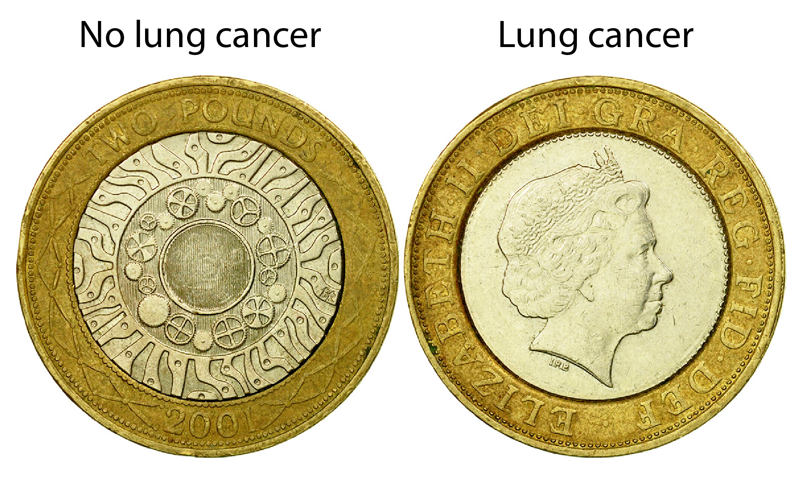
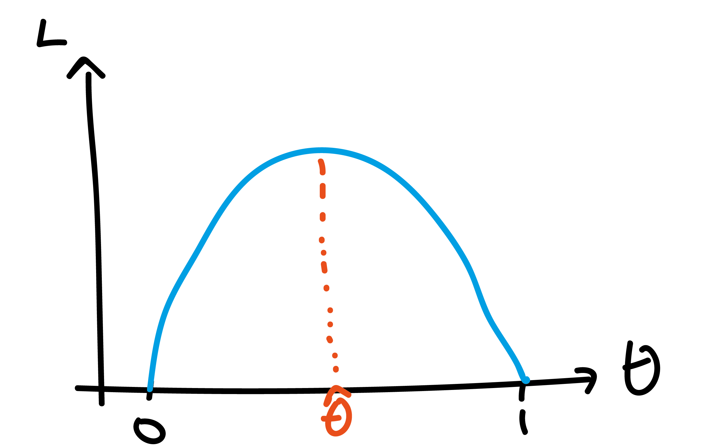
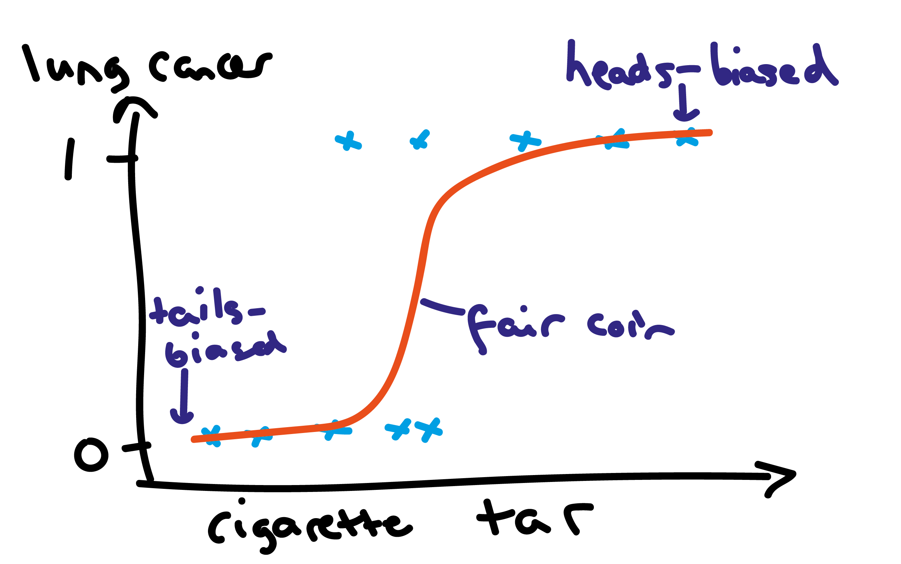
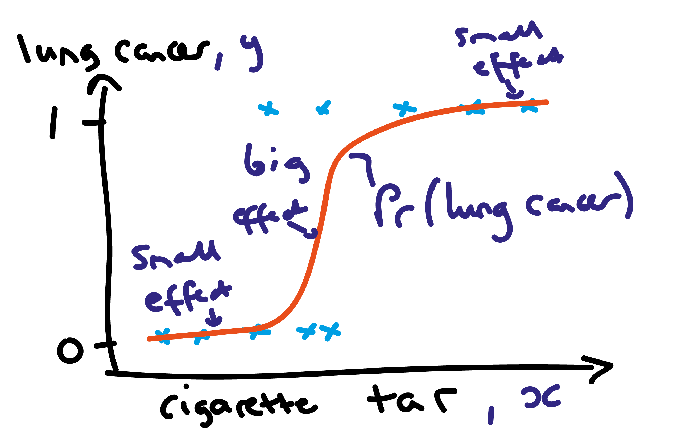

## Material covered in this lecture

- what is logistic regression?
- what cost function to use for logistic regression?
- how to train these models?

## Logistic regression

- confusingly, it is a classifier not a regression (in the ML sense)
- it is used to create models to classify binary data
- very common across ML and statistics

## Example data
```{r, echo = FALSE, out.width = "1000px",fig.align="center"}
  knitr::include_graphics("figures/logistic-1.png")
```

## Cancer and coins

Denote:

- $y_i=0$ indicates cancer-free
- $y_i=1$ indicates presence of lung cancer

Two outcomes is like flipping a coin!

## How to model these data?
```{r, echo = FALSE, out.width = "1000px",fig.align="center"}
  
```

## Coin flipping distribution

Denote:

- $\text{Pr}(y_i=0) = 1-\theta$
- $\text{Pr}(y_i=1) = \theta$

where $0\leq \theta \leq 1$. We can represent in the following probability distribution:

$$\text{Pr}(y_i=y) = \theta^y(1-\theta)^{1-y} $$

which is known as the Bernoulli distribution:

\begin{equation}
y_i \sim \text{Bernoulli}(\theta)
\end{equation}

## How to estimate coin bias?

Suppose you flip coin twice: $y_1=1$, $y_2=0$. Assuming independence:

\begin{equation}
\text{Pr}(y_1=1,y_2=0|\theta) = \theta \times (1-\theta).
\end{equation}

We call $L(\theta)=\text{Pr}(y_1=1,y_2=0|\theta)$ a likelihood.

## Maximum likelihood estimation

Want to choose $\theta$ to maximise probability of obtaining those results

```{r, echo = FALSE, out.width = "700px",fig.align="center"}
  
```

## Derivatives

Find maximum by differentiating:

\begin{equation}
\frac{d L}{d\theta} = 1 - 2 \theta = 0
\end{equation}

Rearranging, we obtain:

\begin{equation}
\theta = \frac{1}{2}
\end{equation}

## How to model these data?
```{r, echo = FALSE, out.width = "1000px",fig.align="center"}
  knitr::include_graphics("figures/logistic-1.png")
```

## Biased coins
```{r, echo = FALSE, out.width = "1000px",fig.align="center"}
  
```

## How to model bias?

In logistic regression, we use logistic function:

\begin{equation}
\theta = \frac{1}{1 + \exp (-x)}
\end{equation}

```{r, echo = FALSE, out.width = "600px",fig.align="center"}
  knitr::include_graphics("figures/logistic-regression.png")
```

## Logistic regression

We want to estimate how sensitive presence / absence of lung cancer is to tar, so model probability:

\begin{equation}
\theta_i = f_\beta(x_i) := \frac{1}{1 + \exp (-(\beta_0 + \beta_1 x_i))}
\end{equation}

which is known as logistic regression and assume:

\begin{equation}
y_i \sim \text{Bernoulli}(\theta_i)
\end{equation}

## How to estimate $\beta_0$ and $\beta_1$?

Data for one individual $(x_i,y_i)$ have probability:

$$\text{Pr}(y_i=y) = f_\beta(x_i)^y(1-f_\beta(x_i))^{1-y} $$

## Likelihood for two individuals' data

Suppose we have data $(x_1,y_1=1)$ and $(x_2,y_2=0)$.

Assume data are:

- independent
- identically distributed

Then overall probability is just product of individual:

\begin{array}
L &= f_\beta(x_1)^{y_1} (1-f_\beta(x_1))^{1-y_1} f_\beta(x_2)^{y_2}(1-f_\beta(x_2))^{1-y_2}\\
&= f_\beta(x_1) (1-f_\beta(x_2))
\end{array}

## Likelihood for larger datasets

Same logic applies under i.i.d. assumption:

\begin{equation}
L = \prod_{i=1}^{K} f_\beta(x_i)^{y_i} (1 - f_\beta(x_i))^{1 - y_i}
\end{equation}

## Maximum likelihood estimation

Unlike the simple coin flipping case, there is no analytic solution to the maximum likelihood estimates. Instead, do gradient descent:

\begin{align}
\beta_0 &= \beta_0 - \eta \frac{\partial L}{\partial \beta_0}\\
\beta_1 &= \beta_1 - \eta \frac{\partial L}{\partial \beta_1}
\end{align}

where $\eta>0$ is the learning rate.

## How to interpret model estimates?

Suppose we estimate that $\beta_0=-1$ and $\beta_1=2$. What do these mean?

\begin{equation}
\theta_i = \frac{1}{1 + \exp (-(-1 + 2 x_i))}
\end{equation}

so impact of incremental changes in $x_i$ on the probability of lung cancer is nonlinear

## Nonlinear impact
```{r, echo = FALSE, out.width = "1000px",fig.align="center"}
  
```

## Can we find an interpretation?

\begin{equation}
\theta_i = \frac{1}{1 + \exp (-(-1 + 2 x_i))}
\end{equation}

meaning

\begin{equation}
1-\theta_i = \frac{\exp (-(-1 + 2 x_i))}{1 + \exp (-(-1 + 2 x_i))}
\end{equation}

## Calculate odds

The ratio of probability of lung cancer to probability of cancer-free is called odds:

\begin{align}
\frac{\theta_i}{1-\theta_i} &=\exp (-1 + 2 x_i)
\end{align}

so here $\exp 2\approx 7.4$ gives the change to the odds for a one unit change in x_i. Because of this, $\exp \beta_1$ is known as the odds ratio for that variable

## Odds ratios

- if $\beta_1 > 0$, the odds ratio $>1$, which indicates that a changes to a variable increase the probability of the $y_i=1$ event occuring.
- vice versa for $\beta_1 < 0$.

## Log odds interpretation

Taking log of both sides:

\begin{equation}
\log \frac{\theta_i}{1-\theta_i} = -1 + 2 x_i
\end{equation}

so we see that $\beta_1=2$ effectively gives the change to the log-odds for a one unit change in $x_i$.

## Multivariate logistic regression

straightforward to extend the model to incorporate multiple regressions:

\begin{equation}
f_\beta(x_i) := \frac{1}{1 + \exp (-(\beta_0 + \beta_1 x_{1,i} + ... + \beta_p x_{p,i}))}
\end{equation}

## Logistic regression summary

- logistic regression models are binary classifiers (in ML speak)
- assumes Bernoulli distribution for outputs
- logistic function used to relate changes in inputs to outputs
- multivariate logistic regression is a commonly used tool