## Material covered today

- what is meant by machine learning?
- two types of machine learning: supervised and unsupervised
- linear and logistic regression
- how to train a ML model? gradient descent
- what do over- and under-fitting mean?

# What is machine learning? (At two levels of difficulty.)

## Level 1

```{r setup, include=FALSE}
knitr::opts_chunk$set(echo = TRUE)
library(tidyverse)
library(reshape2)
```

## Varieties (ignoring reinforcement learning)

```{r, echo = FALSE, out.width = "800px",fig.align="center",warnings=FALSE}
  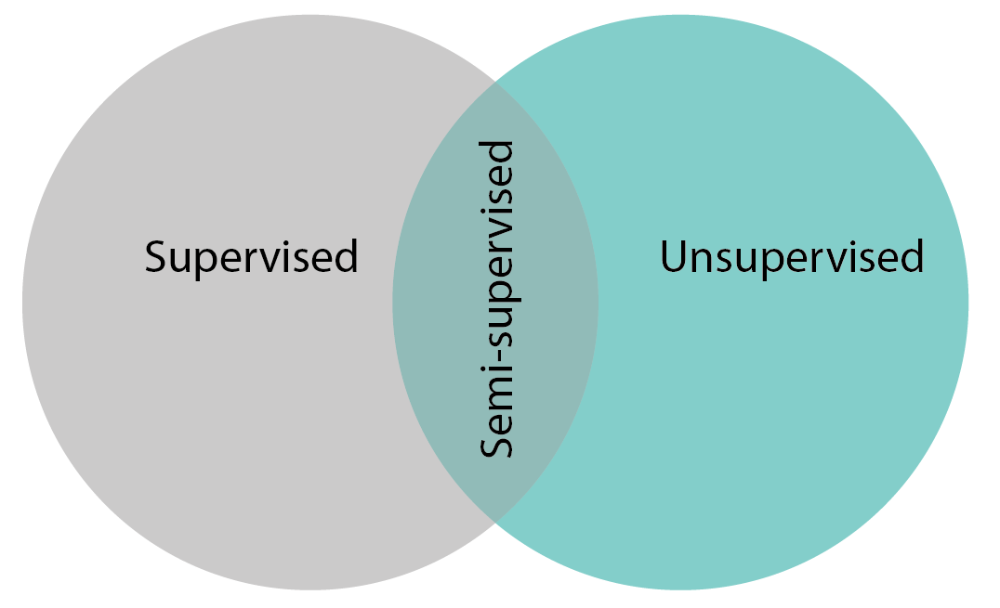
```

## Supervised: classification

```{r, echo = FALSE, out.width = "800px",fig.align="center"}
  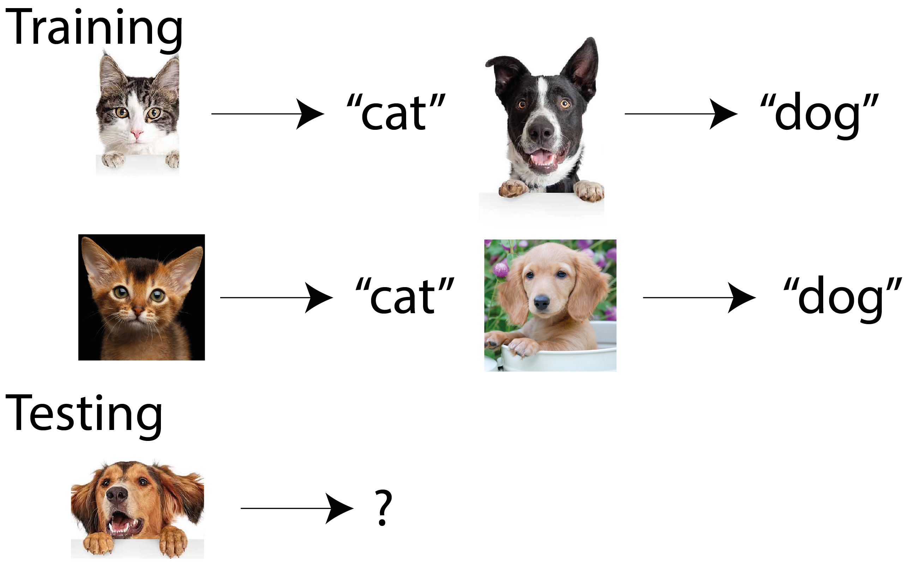
```

## Supervised: regression

```{r, echo = FALSE, out.width = "800px",fig.align="center"}
  knitr::include_graphics("figures/supervised_2.png")
```

## Unsupervised: data

```{r, echo = FALSE, out.width = "600px",fig.align="center"}
  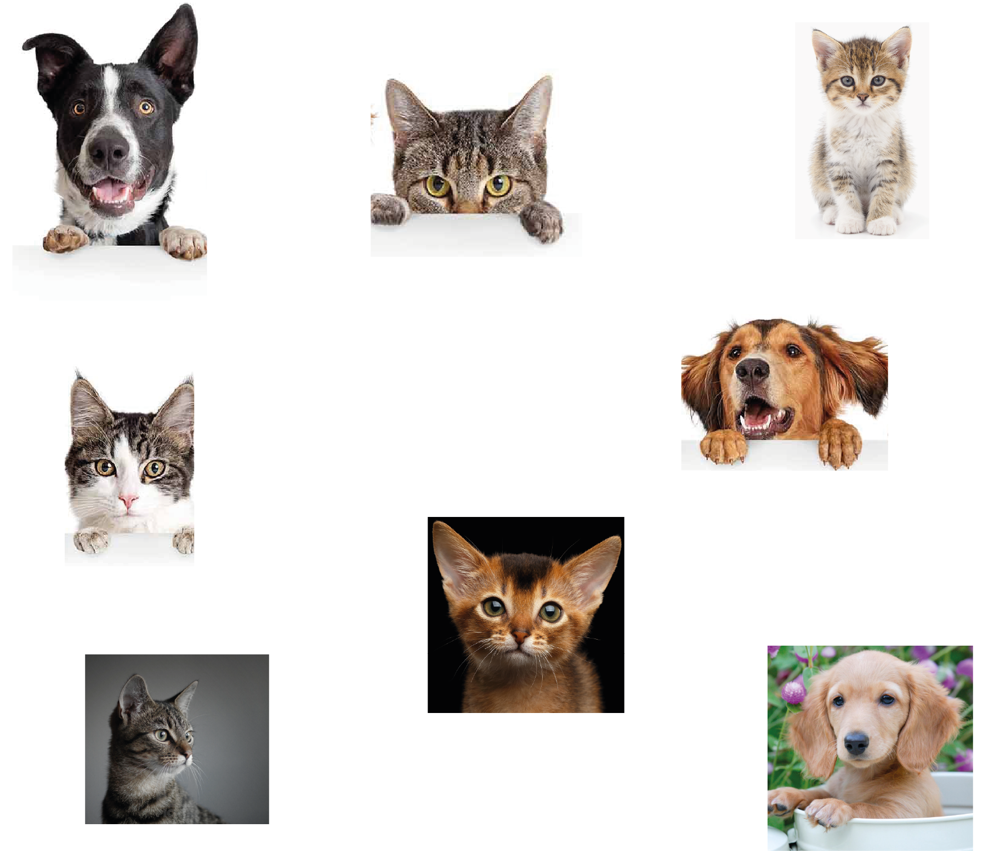
```

## Unsupervised: example result

```{r, echo = FALSE, out.width = "600px",fig.align="center"}
  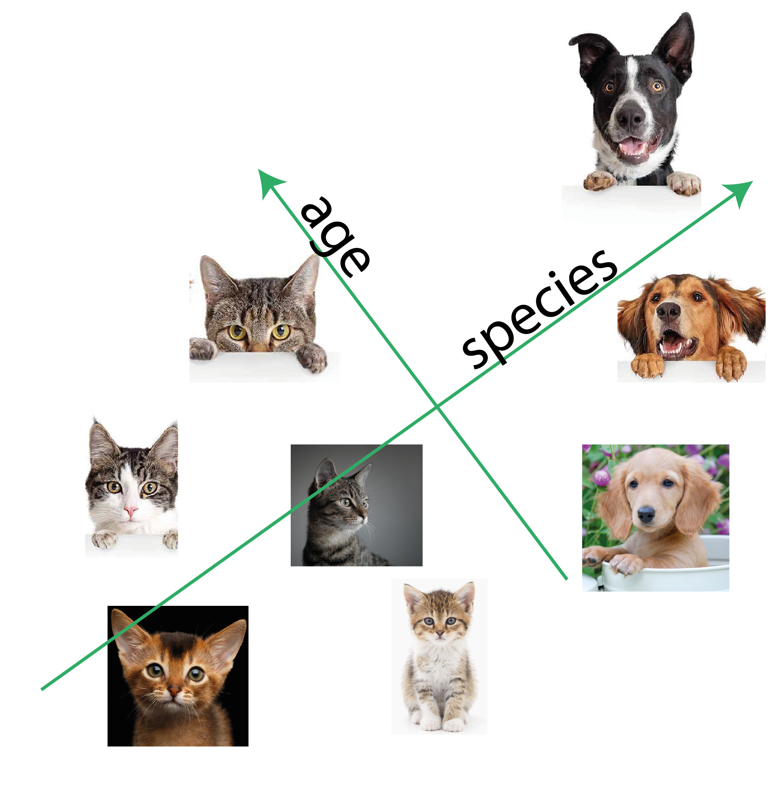
```

## Level 1: summary
Machine learning comes in two varieties:

- supervised learning:
    - typically lots of data-label pairs
    - aim is to build a model data -> label
    - categorical labels: classification
    - numeric labels: regression
- unsupervised learning:
    - unlabelled data
    - goals are vaguer but generally aims to simplify data and uncover patterns
    
## Level 2

## How does a computer "see" a cat?
```{r, echo = FALSE, out.width = "600px",fig.align="center"}
  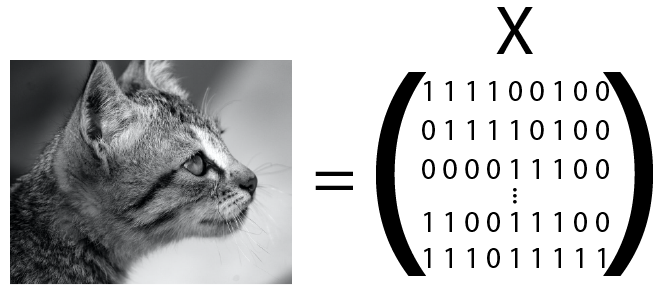
```

## How many images are possible?

- for a 20 x 20 binary image -> $X$ has dimensionality of 400
- $2^{400}\approx 2 \times 10^{120}$ possible images
- a very small proportion of those correspond to real world type images
- a very small proportion of real world images correspond to cats
- idea: even if dimensionality is big, effective dimensionality much lower
    - ML aims to find these lower dimensional representations

## Supervised learning

## Supervised learning
```{r, echo = FALSE, out.width = "600px",fig.align="center"}
  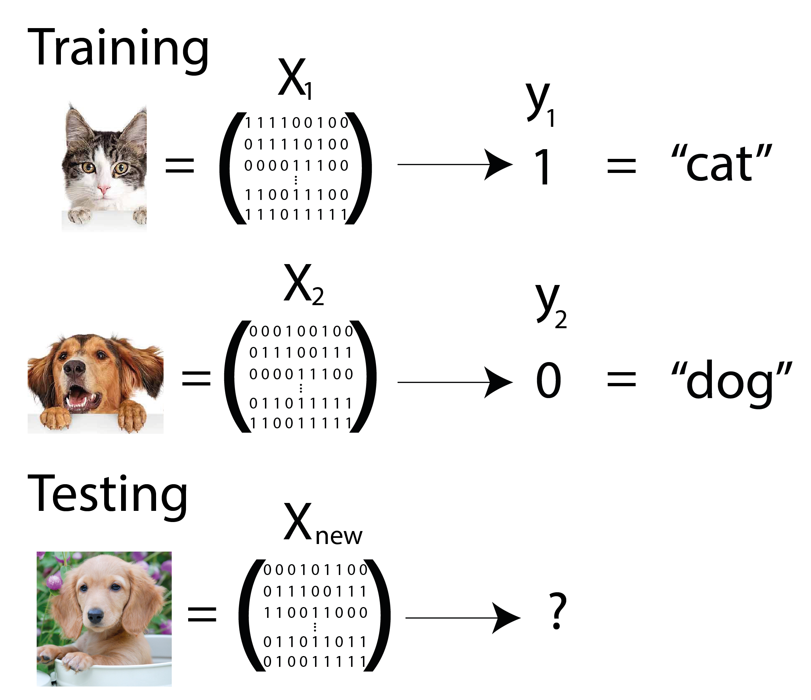
```

## Rule determination

- Want to learn a rule $f: X \rightarrow y$
- Rule is a mathematical function controlled by low-dimensional parameters: $f=f(\theta)$
- Have training data:

$$(X_1, y_1), (X_2, y_2), ..., (X_n, y_n)$$

Can we learn $f$ by optimising $\theta$ on training data?

## Example rules
```{r, echo = FALSE, out.width = "600px",fig.align="center"}
  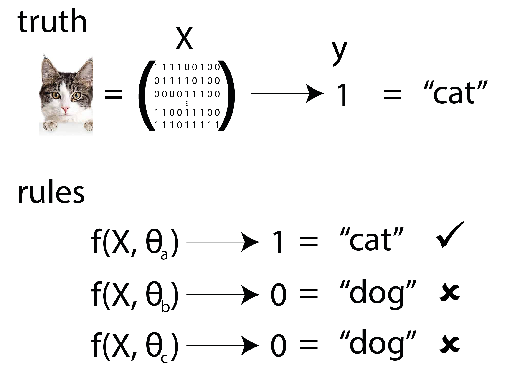
```

## What is  $\; f$?

- Linear combination of elements of $X$ (linear regression)
- Linear combination of functions of elements of $X$ (kernel regression)
- Regression trees (random forests, boosted regression)
- Non-linear combinations of elements, stacked into multiple layers (deep learning)

## How to learn optimal parameters?
```{r, echo = FALSE, out.width = "1000px",fig.align="center"}
  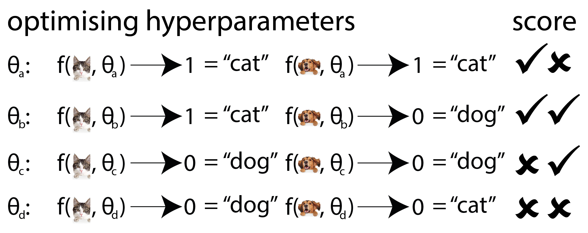
```

## Unsupervised learning
  
## Unsupervised learning
```{r, echo = FALSE, out.width = "800px",fig.align="center"}
  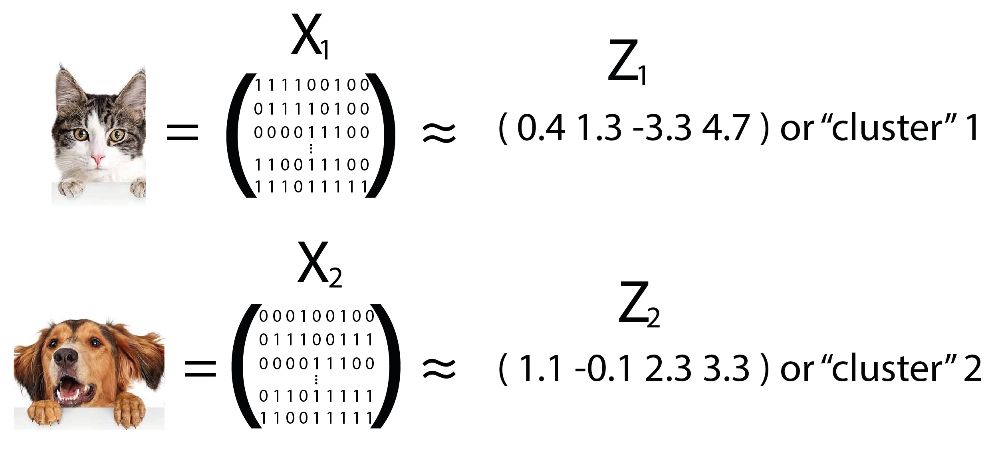
```

## Unsupervised learning: what does $Z$ capture?
```{r, echo = FALSE, out.width = "800px",fig.align="center"}
  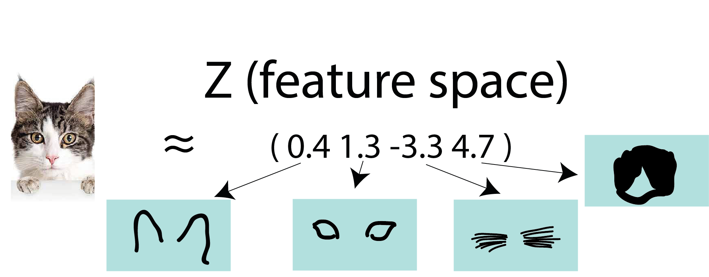
```

## Unsupervised learning: clustering
```{r, echo = FALSE, out.width = "800px",fig.align="center"}
  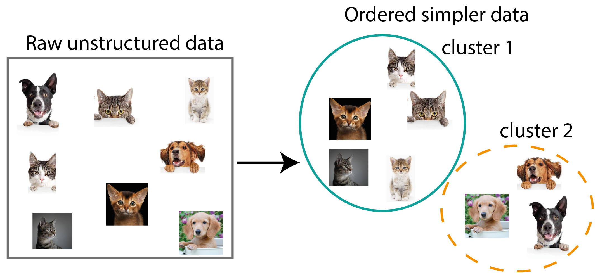
```

## Level 2: summary

- ML algorithms take numeric objects (vectors / matrices / tensors) as input
- intrinsic dimensionality of most things $<$ raw dimensions: world simpler
- supervised learning:
    - determines a mathematical function to predict outputs from inputs
    - function depends on parameters which must be learned using training / testing data
    - learning based on optimising cost function
    
## Level 2: summary
- unsupervised learning:
    - attempts to find more parsimonious representation of data
    - low dimensional variables learned may be more interpretable
    - clustering is an example of unsupervised ML

## Questions?

# Supervised ML

# Linear regression

## Example data

```{r, echo = FALSE, out.width = "1000px",fig.align="center"}
  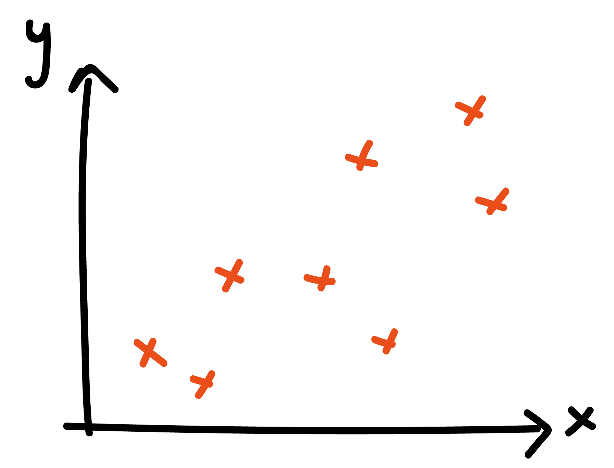
```

## Non-probabilistic model

\begin{equation}
y_i = \alpha + \beta x_i + \epsilon_i
\end{equation}

where $\epsilon_i$ is an error term. Define mean-squared loss:

\begin{equation}
L = \frac{1}{K} \sum_{i=1}^{K} (y_i - (\alpha + \beta x_i))^2
\end{equation}


## What does this model look like?

```{r, echo = FALSE, out.width = "1000px",fig.align="center"}
  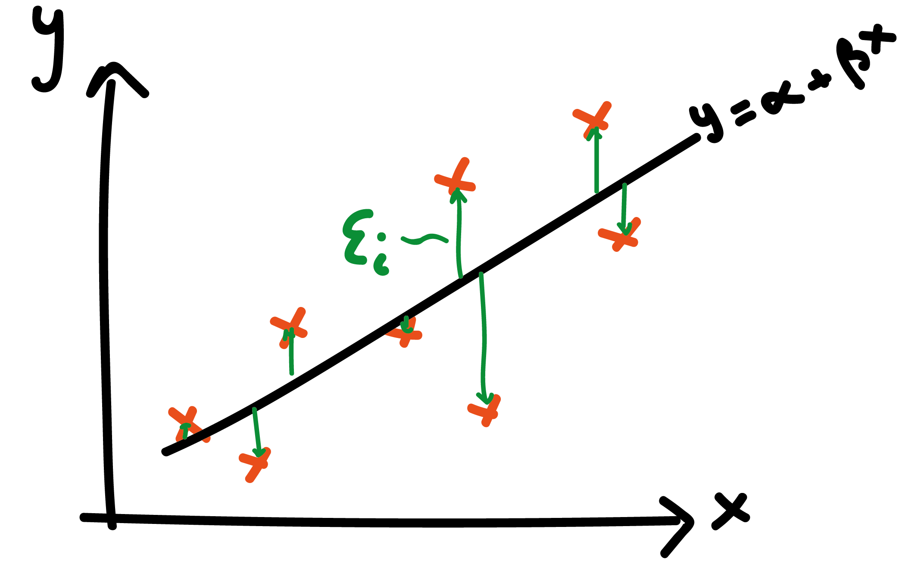
```

## Learning parameters

determine $\hat{\alpha}$ and $\hat{\beta}$ as those minimising $L$:

\begin{align}
\frac{\partial L}{\partial \alpha} &= -\frac{2}{K}\sum_{i=1}^{K} (y_i - (\alpha + \beta x_i)) = 0\\
\frac{\partial L}{\partial \beta} &= -\frac{2}{K}\sum_{i=1}^{K} x_i (y_i - (\alpha + \beta x_i)) = 0
\end{align}

## Gradient descent

although a closed form expression exists for $\hat{\alpha}$ and $\hat{\beta}$, for more general models, one doesn't exist $\implies$ use gradient descent optimisation

1. initialise parameters $\alpha=\alpha_0$, $\beta=\beta_0$
2. in each epoch update parameters:

\begin{align}
\alpha &= \alpha - \eta \frac{\partial L}{\partial \alpha}\\
\beta &= \beta - \eta \frac{\partial L}{\partial \beta}
\end{align}

until $\alpha$ and $\beta$ no longer change. $\eta$ is the learning rate

## Linear regression with polynomial terms

\begin{equation}
y_i = \theta_0 + \theta_1 x_i + \theta_2 x_i^2 + ... + \theta_p x_i^p + \epsilon_i
\end{equation}

model is better able to fit more complex datasets

## Is this a good fit?

```{r, echo = FALSE, out.width = "1000px",fig.align="center"}
  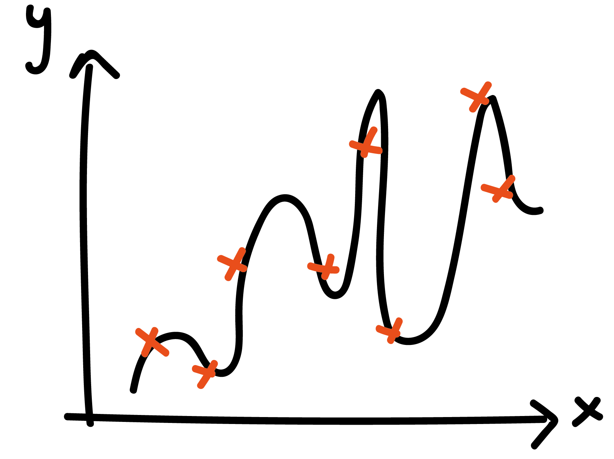
```

## What went wrong?

- adding more parameters always reduces error on training set
- but results in a model that generalises poorly

## What is a good fitting model?

```{r, echo = FALSE, out.width = "1000px",fig.align="center"}
  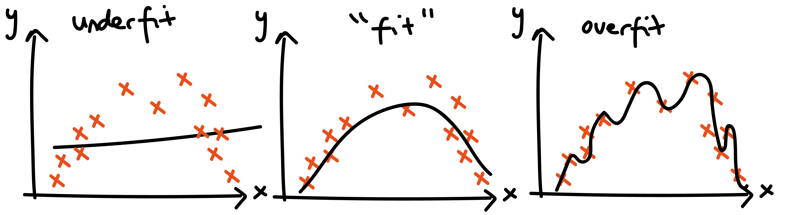
```

## Solutions

- need a separate validation set to test model predictions on
- regularisation can help too, yielding a new objective function:

\begin{equation}
L = C||\theta||_q + \frac{1}{K} \sum_{i=1}^{K} (y_i - f_p(x_i))^2
\end{equation}

where $||.||_q$ denotes the $L_q$ norm: different choices can yield very different estimates

## Linear regression summary

- linear regression defines a loss function (typically mean squared error) between actual and predicted observations
- training can be done via gradient descent: each epoch corresponds to a single parameter update
- (gradient descent also used to train many other methods, like neural nets)
- fitting regression with more complex functional forms can fit more complex data
- but risks poor generalisation

## Questions?

# K-nearest neighbours: classification and regression

## KNN

- non-model-based learning algorithm
- keeps training data in memory when making predictions, in contrast to most other methods
- generally fast to run compared to many model-based approaches
- straightforward premise for both classification and regression

## KNN classification

for new data point $\tilde x_i$:

1. find $k$ nearest $x$ values from training data $(x_i, y_i)$ for $i=1,...,n$
2. tally up the corresponding $y$ labels: $(y_1,..,y_k)$
3. classify $\tilde x_i \rightarrow \text{mode}(y_1,..,y_k)$

## KNN regression

for new data point $\tilde x_i$:

1. find $k$ nearest $x$ values from training data $(x_i, y_i)$ for $i=1,...,n$
2. tally up the corresponding $y$ labels: $(y_1,..,y_k)$
3. classify $\tilde x_i \rightarrow \text{mean}(y_1,..,y_k)$

## Distance metrics

many options possible. Common metrics include:

- Euclidean: $s(x_1,x_2) = \sqrt{\sum_{i=1}^{D} (x_{1,i} - x_{2,i})^2}$
- cosine similarity:

\begin{equation}
s(x_1,x_2) = \frac{x_1.x_2}{|x_1||x_2|}
\end{equation}

## Example data

```{r, echo = FALSE, warning=FALSE, message=FALSE}
library(RANN)
library(tidyverse)
n <- 200
x <- rnorm(n, 0, 4)
y <- sin(x) + rnorm(n, 0, 0.2)

f_kk_regression <- function(x_tilde, x, y, k=10) {
  fit <- nn2(x, c(x_tilde), k = k)
  idxs <- fit$nn.idx[1, ]
  return(mean(y[idxs]))
}

x_sim <- seq(-10, 10, 0.1)
y_sim <- map_dbl(x_sim, ~f_kk_regression(., x, y))

df <- tibble(x, y) %>% 
  mutate(type="actual") %>% 
  bind_rows(tibble(x=x_sim, y=y_sim) %>% mutate(type="regression"))

p <- ggplot(df %>% filter(type=="actual"), aes(x=x, y=y)) +
  geom_point()
p
```

## KNN with k=10
```{r, echo = FALSE, warning=FALSE, message=FALSE}
 p + geom_line(data=df %>% filter(type=="regression"), colour="blue")
```

## KNN with k=1
```{r, echo = FALSE, warning=FALSE, message=FALSE}
y_sim <- map_dbl(x_sim, ~f_kk_regression(., x, y, k = 2))

df <- tibble(x, y) %>% 
  mutate(type="actual") %>% 
  bind_rows(tibble(x=x_sim, y=y_sim) %>% mutate(type="regression"))

p + geom_line(data=df %>% filter(type=="regression"), colour="blue")
```

## KNN with k=50
```{r, echo = FALSE, warning=FALSE, message=FALSE}
y_sim <- map_dbl(x_sim, ~f_kk_regression(., x, y, k = 50))

df <- tibble(x, y) %>% 
  mutate(type="actual") %>% 
  bind_rows(tibble(x=x_sim, y=y_sim) %>% mutate(type="regression"))

p + geom_line(data=df %>% filter(type=="regression"), colour="blue")
```

## Issue with KNN

assume

\begin{equation}
\boldsymbol{x} \sim \mathcal{N}(0, I)
\end{equation}

where $I\in\mathbb{R}^d$. What does the distribution of Euclidean distances between points look like as $d$ changes?

## Distance dists: neighbours not near in higher D
```{r, echo = FALSE, warning=FALSE, message=FALSE}
library(mvtnorm)
rmvrnormND <- function(n, d){
  return(rmvnorm(n, mean = rep(0, d)))
}

rcubeND <- function(n, d) {
  m_vals <- runif(n * d)
  return(matrix(m_vals, ncol = d))
}

f_dists <- function(n, d) {
  x_2 <- rmvrnormND(n, d)
  m_dist <- dist(x_2) %>% as.matrix()
  return(tibble(dist=m_dist[upper.tri(m_dist, diag=FALSE)],
                dimension=d))
}

n <- 200
x_2 <- f_dists(n, 2)
x_3 <- f_dists(n, 3)
x_5 <- f_dists(n, 5)
x_10 <- f_dists(n, 100)

x_2 %>% 
  bind_rows(x_3) %>% 
  bind_rows(x_5) %>% 
  bind_rows(x_10) %>% 
  ggplot(aes(x=dist)) +
  geom_histogram(bins=200) +
  facet_wrap(~dimension) +
  theme(strip.text = element_text(size=16),
        axis.text = element_text(size=16),
        axis.title = element_text(size=16)) +
  xlab("Distance")
```

## KNN summary

- KNN uses a simple device to do both classification and regression
- in both cases taken the $k$ closest points to choose label or value
- $k$ controls the smoothness of predictions
- generally cheaper to run than other models
- in higher dimensions, less useful

## Questions?

# Logistic regression

## Logistic regression

- confusingly, this is a classifier not a regression (in the ML sense)
- models data as generated from a Bernoulli probability distribution
- probability parameter of Bernoulli modelled by logistic function, hence the name
- simple classifier but yields interpretable results and can be estimated in Bayesian framework

## Model for binary data

- suppose we have many labelled tuples of $(x_{i}, y_i)$
- where $y_i$ is binary: here, we set $y_i=0$ for one category; $y_i=1$ for the other
- since outcome is binary $\implies$ use an appropriate probability distribution:

\begin{equation}
y_i \sim \text{Bernoulli}(\theta_i)
\end{equation}

where $0\leq \theta_i \leq 1 = Pr(y_i=1)$

## Bernoulli probability distribution

is given by:

\begin{equation}
\text{Pr}(y_i|\theta_i) = \theta_i^{y_i} (1 - \theta_i)^{1 - y_i}
\end{equation}

so that $\text{Pr}(y_i=1) = \theta_i$ and $\text{Pr}(y_i=0) = 1 - \theta_i$

## Logistic function

In logistic regression, we use logistic function:

\begin{equation}
\theta_i = f_\beta(x_i) := \frac{1}{1 + \exp (-(\beta_0 + \beta_1 x_i))}
\end{equation}

```{r, echo = FALSE, out.width = "600px",fig.align="center"}
  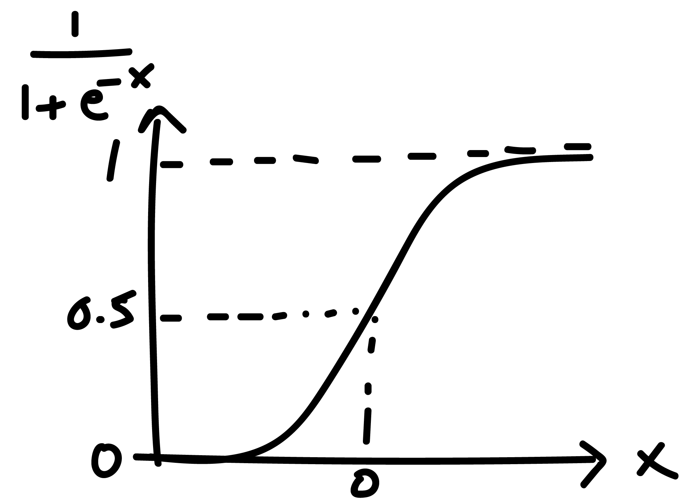
```

## Likelihood and Bayesian estimation

assume data are i.i.d., the likelihood is:

\begin{equation}
L=p(\boldsymbol{y}|\beta,\boldsymbol{x}) = \prod_{i=1}^{K} f_\beta(x_i)^{y_i} (1 - f_\beta(x_i))^{1 - y_i}.
\end{equation}

Can use gradient descent to find maximum likelihood estimates (or estimate using Bayesian inference).

## Multivariate logistic regression

straightforward to extend the model to incorporate multiple regressions:

\begin{equation}
f_\beta(x_i) := \frac{1}{1 + \exp (-(\beta_0 + \beta_1 x_{1,i} + ... + \beta_p x_{p,i}))}
\end{equation}

But how to interpret parameters of logistic regression?

## Log-odds ratios

another way of writing logistic function:

\begin{align}
f_\beta(x_i) &= \frac{1}{1 + \exp (-(\beta_0 + \beta_1 x_{1,i} + ... + \beta_p x_{p,i}))}\\
&= \frac{\exp (\beta_0 + \beta_1 x_{1,i} + ... + \beta_p x_{p,i})}{1 + \exp (\beta_0 + \beta_1 x_{1,i} + ... + \beta_p x_{p,i})}
\end{align}

so that

\begin{align}
1 - f_\beta(x_i) = \frac{1}{1 + \exp (\beta_0 + \beta_1 x_{1,i} + ... + \beta_p x_{p,i})}
\end{align}

## Log-odds ratios

taking the ratio:

\begin{equation}
\text{odds} = \frac{f_\beta(x_i)}{1-f_\beta(x_i)} = \exp (\beta_0 + \beta_1 x_{1,i} + ... + \beta_p x_{p,i})
\end{equation}

so that

\begin{equation}
\log\text{odds} =\beta_0 + \beta_1 x_{1,i} + ... + \beta_p x_{p,i}
\end{equation}

meaning (say) $\beta_1$ represents the change in log-odds for a one unit change in $x_{1}$

## Logistic regression summary

- logistic regression models are binary classifiers (in ML speak)
- assumes Bernoulli distribution for outputs
- logistic function used to relate changes in inputs to outputs
- estimatable via Bayesian inference
- multivariate logistic regression is a commonly used tool

## Questions?

---


# Summary

## Summary

- unsupervised and supervised learning aim to achieve different goals
- dimensionality reduction is one variety of unsupervised learning
- PCA is a linear projection method

## Summary

- clustering methods can reduce data down to a single dimension
- k-means works for simple datasets

## Summary
- supervised ML uses labelled data to make predictions
- linear regression is a form of regression model
- model with more parameters are likely to overfit more
- logistic regression is a binary classifier

## How to learn more?

All available on SOLO:

- "The hundred-page machine learning book", Burkov
- "Hands-On machine learning with Scikit-Learn & Tensorflow", Geron

Coursera:

- Data Science: Statistics and Machine Learning Specialization, Johns Hopkins