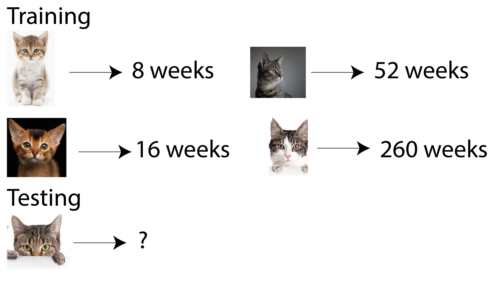
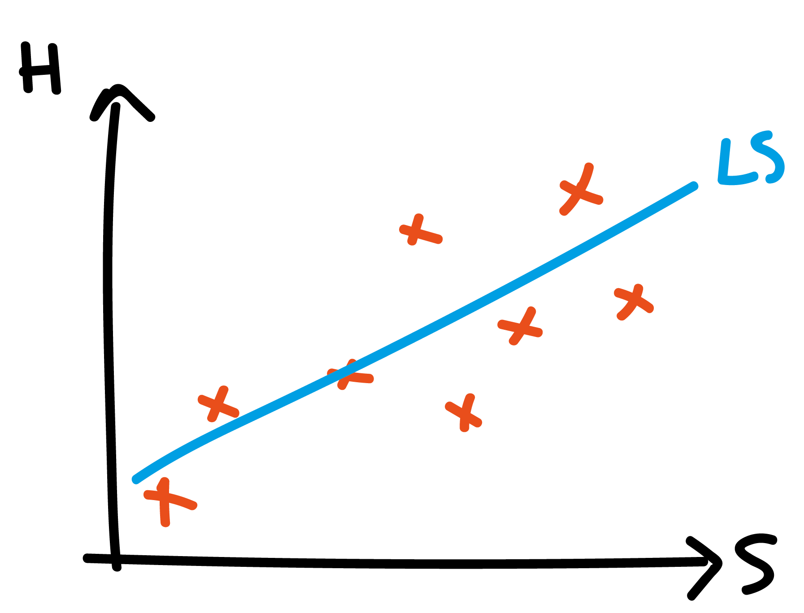
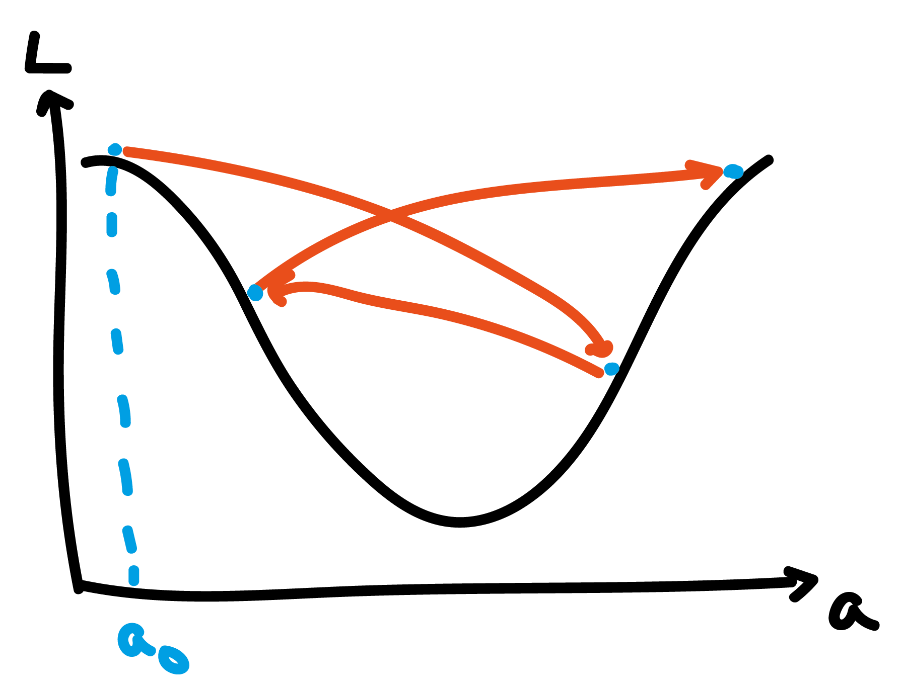
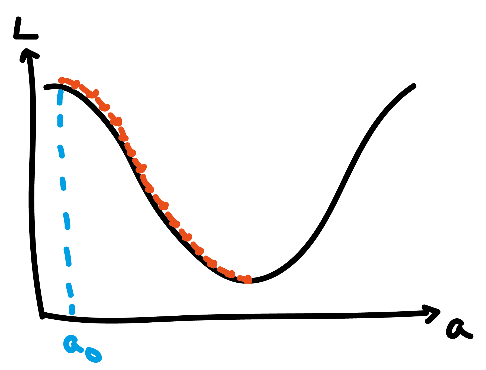

## Material covered today

- what is meant by machine learning?
- two types of machine learning: supervised and unsupervised
- linear (AM) and logistic (PM) regression
- how to train a ML model? gradient descent
- what do over- and under-fitting mean?

# What is machine learning? (At two levels of difficulty.)

## Level 1

```{r setup, include=FALSE}
knitr::opts_chunk$set(echo = TRUE)
library(tidyverse)
library(reshape2)
```

## Varieties (ignoring reinforcement learning)

```{r, echo = FALSE, out.width = "800px",fig.align="center",warnings=FALSE}
  knitr::include_graphics("figures/ml_types-01.png")
```

## Supervised: classification

```{r, echo = FALSE, out.width = "800px",fig.align="center"}
  knitr::include_graphics("figures/supervised_1.png")
```

## Supervised: regression

```{r, echo = FALSE, out.width = "800px",fig.align="center"}
  
```

## Unsupervised: data

```{r, echo = FALSE, out.width = "600px",fig.align="center"}
  knitr::include_graphics("figures/unsupervised_1.png")
```

## Unsupervised: example result

```{r, echo = FALSE, out.width = "600px",fig.align="center"}
  
```

## Level 1: summary
Machine learning comes in two varieties:

- supervised learning:
    - typically lots of data-label pairs
    - aim is to build a model data -> label
    - categorical labels: classification
    - numeric labels: regression
- unsupervised learning:
    - unlabelled data
    - goals are vaguer but generally aims to simplify data and uncover patterns
    
## Level 2

## How does a computer "see" a cat?
```{r, echo = FALSE, out.width = "600px",fig.align="center"}
  
```

## How many images are possible?

- for a 20 x 20 binary image -> $X$ has dimensionality of 400
- $2^{400}\approx 2 \times 10^{120}$ possible images
- a very small proportion of those correspond to real world type images
- a very small proportion of real world images correspond to cats
- idea: even if dimensionality is big, effective dimensionality much lower
    - ML aims to find these lower dimensional representations

## Supervised learning

## Supervised learning
```{r, echo = FALSE, out.width = "600px",fig.align="center"}
  
```

## Rule determination

- Want to learn a rule $f: X \rightarrow y$
- Rule is a mathematical function controlled by low-dimensional parameters: $f=f(\theta)$
- Have training data:

$$(X_1, y_1), (X_2, y_2), ..., (X_n, y_n)$$

Can we learn $f$ by optimising $\theta$ on training data?

## Example rules
```{r, echo = FALSE, out.width = "600px",fig.align="center"}
  knitr::include_graphics("figures/supervised_4.png")
```

## What is  $\; f$?

- Linear combination of elements of $X$ (linear regression)
- Linear combination of functions of elements of $X$ (kernel regression)
- Regression trees (random forests, boosted regression)
- Non-linear combinations of elements, stacked into multiple layers (deep learning)

## How to learn optimal parameters?
```{r, echo = FALSE, out.width = "1000px",fig.align="center"}
  
```

## Unsupervised learning
  
## Unsupervised learning
```{r, echo = FALSE, out.width = "800px",fig.align="center"}
  knitr::include_graphics("figures/unsupervised_3.png")
```

## Unsupervised learning: what does $Z$ capture?
```{r, echo = FALSE, out.width = "800px",fig.align="center"}
  knitr::include_graphics("figures/unsupervised_4.png")
```

## Unsupervised learning: clustering
```{r, echo = FALSE, out.width = "800px",fig.align="center"}
  
```

## Level 2: summary

- ML algorithms take numeric objects (vectors / matrices / tensors) as input
- intrinsic dimensionality of most things $<$ raw dimensions: world simpler
- supervised learning:
    - determines a mathematical function to predict outputs from inputs
    - function depends on parameters which must be learned using training / testing data
    - learning based on optimising cost function
    
## Level 2: summary
- unsupervised learning:
    - attempts to find more parsimonious representation of data
    - low dimensional variables learned may be more interpretable
    - clustering is an example of unsupervised ML

## Questions?

# Linear regression

## Example house price versus size data

```{r, echo = FALSE, out.width = "600px",fig.align="center"}
  
```

## Example model: house price and size

\begin{equation}
H_i = a + b S_i + \epsilon_i
\end{equation}

where $H_i$ is the house price; $S_i$ is the size in square feet; and $\epsilon_i$ is an error term.


## What does this model look like?

```{r, echo = FALSE, out.width = "600px",fig.align="center"}
  
```

## What are $\epsilon_i$?
```{r, echo = FALSE, out.width = "600px",fig.align="center"}
  
```

## Choice of loss function

Choose a model to minimise the sum of squared errors, that is:

\begin{equation}
L = \frac{1}{K} \sum_{i=1}^{K} \epsilon_i^2
\end{equation}

which is the same as choosing values of $a$ and $b$ to minimise:

\begin{equation}
L = \frac{1}{K} \sum_{i=1}^{K} (H_i - (a + b S_i))^2
\end{equation}

## Least-squares regression line

```{r, echo = FALSE, out.width = "600px",fig.align="center"}
  
```

## What about other loss functions?

Least absolute deviation loss:

\begin{equation}
L = \frac{1}{K} \sum_{i=1}^{K} |\epsilon_i|
\end{equation}

Quartic power loss:

\begin{equation}
L = \frac{1}{K} \sum_{i=1}^{K} \epsilon_i^4
\end{equation}

## Other regression lines
```{r, echo = FALSE, out.width = "600px",fig.align="center"}
  
```

## How do we estimate parameters?

Suppose we want to minimise a least-squares loss function:

\begin{equation}
L = \frac{1}{K} \sum_{i=1}^{K} (H_i - (a + b S_i))^2
\end{equation}

Choose $a$ and $b$ to minimise this loss $\implies$ differentiate!

## Learning parameters

determine $\hat{a}$ and $\hat{b}$ as those minimising $L$:

\begin{align}
\frac{\partial L}{\partial a} &= -\frac{2}{K}\sum_{i=1}^{K} (H_i - (a + b S_i)) = 0\\
\frac{\partial L}{\partial b} &= -\frac{2}{K}\sum_{i=1}^{K} S_i (H_i - (a + b S_i)) = 0
\end{align}

## General solution of loss-minimisers

For general loss functions, no solution exists. That is, usually equations like:

\begin{align}
-\frac{2}{K}\sum_{i=1}^{K} (H_i - (a + b S_i)) &= 0\\
-\frac{2}{K}\sum_{i=1}^{K} S_i (H_i - (a + b S_i)) &= 0
\end{align}

have no solution. (Here, they actually do.)

## Gradient descent

Instead of solving equations directly, we use gradient descent optimisation

1. initialise parameters $a=a_0$, $b=b_0$
2. in each epoch update parameters:

\begin{align}
a &= a - \eta \frac{\partial L}{\partial a}\\
b &= b - \eta \frac{\partial L}{\partial b}
\end{align}

until $a$ and $b$ no longer change. $\eta$ is the learning rate

## Gradient descent: initial point
```{r, echo = FALSE, out.width = "600px",fig.align="center"}
  
```

## Gradient descent: first step
```{r, echo = FALSE, out.width = "600px",fig.align="center"}
  
```

## Gradient descent: next step
```{r, echo = FALSE, out.width = "600px",fig.align="center"}
  
```

## Gradient descent: convergence
```{r, echo = FALSE, out.width = "600px",fig.align="center"}
  
```

## Gradient descent in 2D
```{r, echo = FALSE, out.width = "600px",fig.align="center"}
  
```

## Too high learning rate
```{r, echo = FALSE, out.width = "600px",fig.align="center"}
  
```

## Too low learning rate
```{r, echo = FALSE, out.width = "600px",fig.align="center"}
  
```

## Making the model more complex

\begin{equation}
H_i = a + b S_i + c S_i^2 + \epsilon_i
\end{equation}

What does this model look like?

## Quadratic regression line
```{r, echo = FALSE, out.width = "600px",fig.align="center"}
  
```

## How to estimate model parameters?

Least-squares loss function:

\begin{equation}
L = \frac{1}{K} \sum_{i=1}^{K} (H_i - (a + b S_i + c S_i^2))^2
\end{equation}

## Then use gradient descent

\begin{align}
a &= a - \eta \frac{\partial L}{\partial a}\\
b &= b - \eta \frac{\partial L}{\partial b}\\
c &= c - \eta \frac{\partial L}{\partial c}
\end{align}

## What about more complex models?

\begin{equation}
H_i = a + b S_i + c S_i^2 + d S_i^3 + ... \epsilon_i
\end{equation}

## More complex model
```{r, echo = FALSE, out.width = "600px",fig.align="center"}
  
```

## Which model is best?
```{r, echo = FALSE, out.width = "800px",fig.align="center"}
  
```

## Original data
```{r, echo = FALSE, out.width = "800px",fig.align="center"}
  knitr::include_graphics("figures/linear-regression-underoverfit-original-data.png")
```

## New data
```{r, echo = FALSE, out.width = "800px",fig.align="center"}
  
```

## What went wrong?

- adding more parameters always reduces error on training set
- but results in a model that generalises poorly
- all else being equal simple models are better

## What is a good fitting model?

```{r, echo = FALSE, out.width = "1000px",fig.align="center"}
  knitr::include_graphics("figures/supervised-regression-5.png")
```

## How to get to a "fit" model?

Hold out a separate validation set to test model predictions on

```{r, echo = FALSE, out.width = "800px",fig.align="center"}
  
```

## Using validation set to determine optimal model complexity
```{r, echo = FALSE, out.width = "800px",fig.align="center"}
  
```

## Will a trained model perform as well  in real life?
No:

- use of validation set means that we effectively overfit to it
- thus create a separate testing set that is used only once to gauge performance

## Create test set
```{r, echo = FALSE, out.width = "800px",fig.align="center"}
  
```

## Linear regression summary

- linear regression defines a loss function (typically mean squared error) between actual and predicted observations
- training can be done via gradient descent: each epoch corresponds to a single parameter update
- (gradient descent also used to train many other methods, like neural nets)
- fitting regression with more complex functional forms can fit more complex data
- but risks poor generalisation

## Questions?

## How to learn more?

All available on SOLO:

- "The hundred-page machine learning book", Burkov
- "Hands-On machine learning with Scikit-Learn & Tensorflow", Geron

Coursera:

- Data Science: Statistics and Machine Learning Specialization, Johns Hopkins